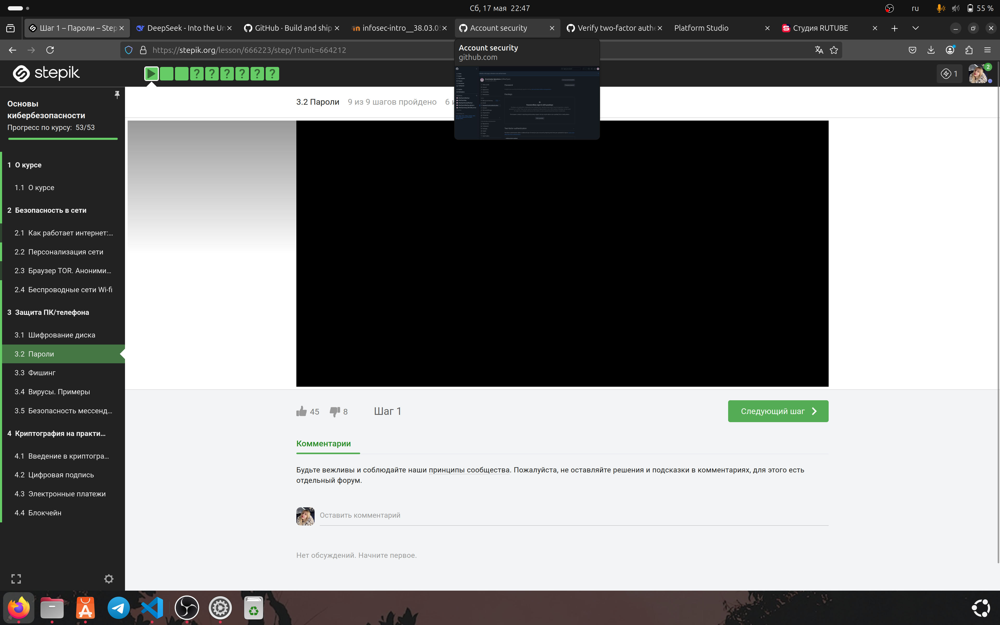
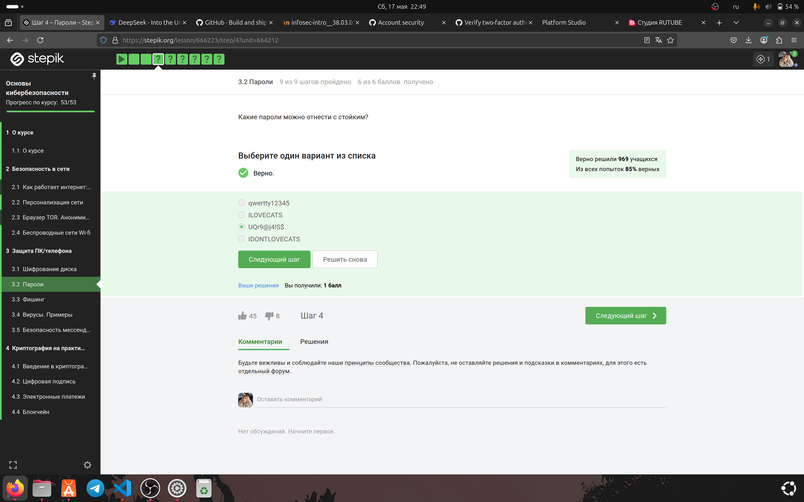
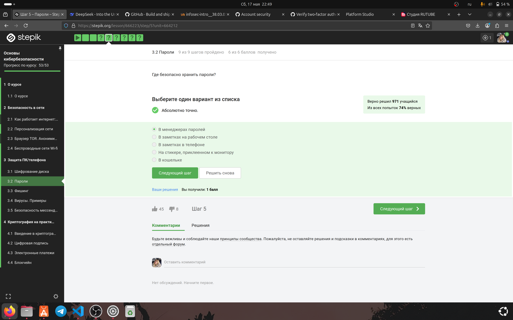
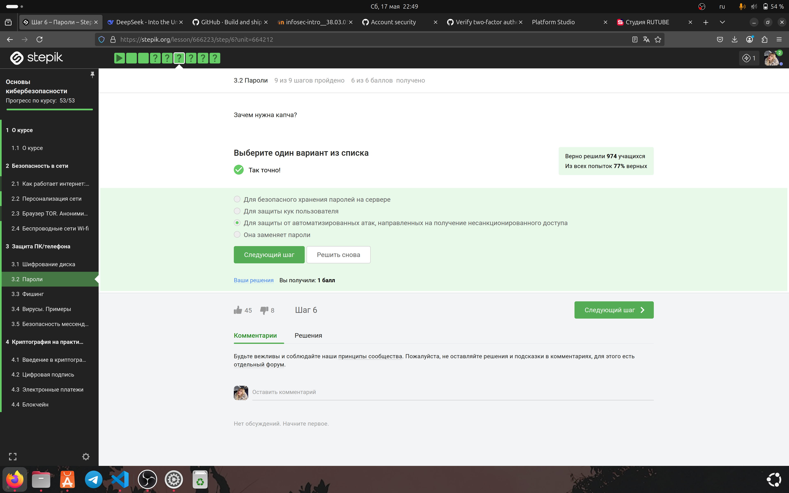
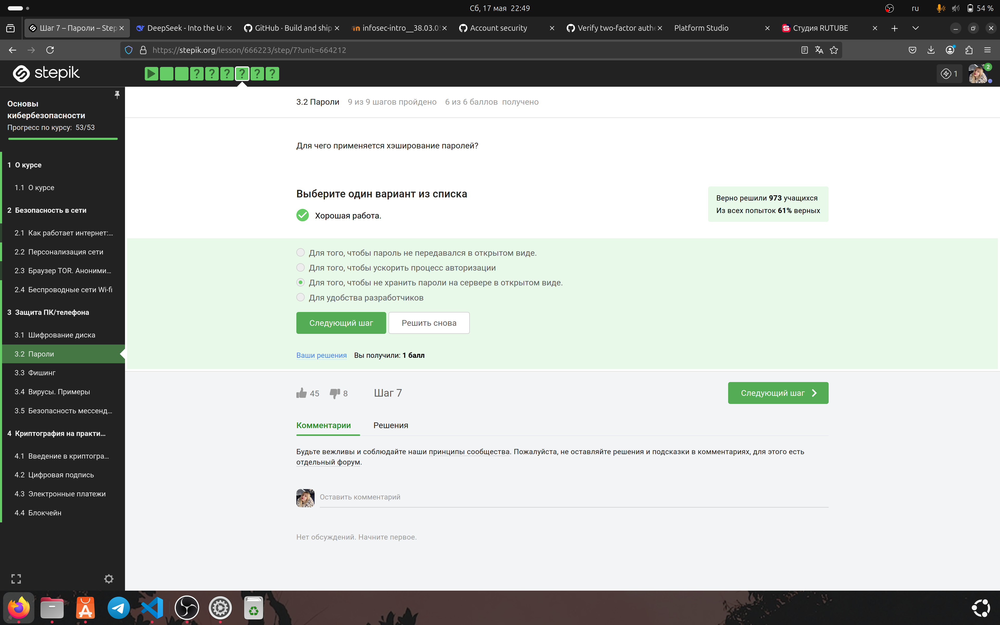
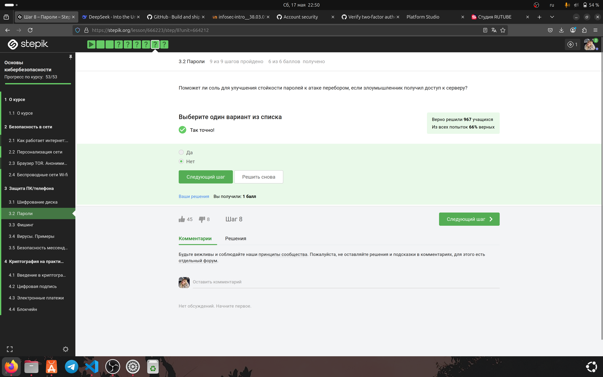
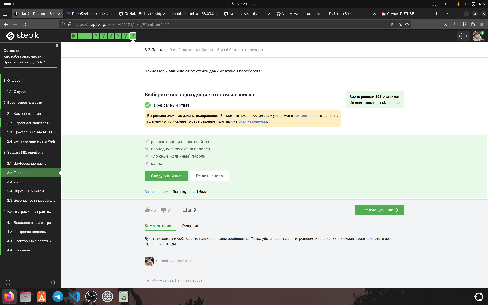

---
# Preamble

## Author

author:
  name: Игнатова Анастасия Александровна
  email: 1132239657@pfur.ru
  affiliation:
    - name: Российский университет дружбы народов
      country: Российская Федерация
      postal-code: 117198
      city: Москва
      address: ул. Миклухо-Маклая, д. 6

## Title

title: "Прохождение внешнего курса stepik 'Основы кибербезопасности'"
subtitle: "3 этап. Защита ПК/телефона"
license: "CC BY"

## Generic options

lang: ru-RU
number-sections: true
toc: true
toc-title: "Содержание"
toc-depth: 2

## Bibliography

bibliography: bib/cite.bib
csl: pandoc/csl/gost-r-7-0-5-2008-numeric.csl

## Pdf output format
format:
  pdf:
    toc: true
    number-sections: true
    colorlinks: false
    toc-depth: 2
    lof: true # List of figures
    lot: true # List of tables
### Document
    documentclass: scrreprt
    papersize: a4
    fontsize: 12pt
    linestretch: 1.5
### Language
    babel-lang: russian
    babel-otherlangs: english
### Fonts
    mainfont: IBM Plex Serif
    romanfont: IBM Plex Serif
    sansfont: IBM Plex Sans
    monofont: IBM Plex Mono
    mathfont: STIX Two Math
    mainfontoptions: Ligatures=Common,Ligatures=TeX,Scale=0.94
    romanfontoptions: Ligatures=Common,Ligatures=TeX,Scale=0.94
    sansfontoptions: Ligatures=Common,Ligatures=TeX,Scale=MatchLowercase,Scale=0.94
    monofontoptions: Scale=MatchLowercase,Scale=0.94,FakeStretch=0.9
### Biblatex
    cite-method: biblatex
    biblio-style: gost-numeric
    biblatexoptions:
      - backend=biber
      - langhook=extras
      - autolang=other*
      # - parentracker=true
      # - hyperref=auto
      # - language=auto
      # - clearlang=true
      # - citestyle=gost-numeric
### Misc options
    csquotes: true
    indent: true
    header-includes: |
      \usepackage{indentfirst}
      \usepackage{float}
      \floatplacement{figure}{H}

## Crossref customization

crossref:
  lof-title: "Список иллюстраций"
  lot-title: "Список таблиц"
  lol-title: "Листинги"
# figureTitle: "Рис."
# tableTitle: "Таблица"
# listingTitle: "Листинг"
---

# Цель работы

Изучить пароли, посмотреть лекции и выполнить задания

# Задание

1. Изучить раздел "Пароли"

2. Посмотреть лекцию

3. Выполнить задания

4. Пояснить выбор ответа на задания

# Теоретическое введение

Прохождение курса https://stepik.org/course/111512

# Выполнение лабораторной работы

### Раздел 3.2 "Пароли"

Я посмотрела первую лекцию, изучила новый материал и сделала конспект

Рис. 1 Просмотр первой лекции

#### Выполнение заданий

1. Приступила к выполнению 1 задания. Я выбрала ответ "UQr9@j4!S$", потому что стойкий пароль содержит не менее 8 символов, включая заглавные/строчные буквы, цифры и спецсимволы, а также лишён очевидных закономерностей или слов (как в остальных вариантах).

Рис. 2 Выполнение 1 задания

2. Приступила к выполнению 2 задания. Я выбрала ответ "В менеджерах паролей", потому что менеджеры паролей (например, Bitwarden, KeePass) обеспечивают шифрованное хранение, генерацию сложных паролей и защиту от утечек, в отличие от заметок, стикеров или кошелька, которые уязвимы к физическому доступу.

Рис. 3 Выполнение 2 задания

3. Приступила к выполнению 3 задания. Я выбрала ответ "Для защиты от автоматизированных атак, направленных на получение несанкционированного доступа", потому что CAPTCHA (Completely Automated Public Turing test to tell Computers and Humans Apart) проверяет, является ли пользователь человеком, блокируя ботов и автоматические скрипты.

Рис. 4 Выполнение 3 задания

4. Приступила к выполнению 4 задания. Я выбрала ответ "Для того, чтобы не хранить пароли на сервере в открытом виде.", потому что хеширование преобразует пароль в уникальную строку (хеш), которую невозможно обратно расшифровать, что защищает данные даже при утечке базы (в отличие от открытого хранения или шифрования).

Рис. 5 Выполнение 4 задания

5. Приступила к выполнению 5 задания. Я выбрала ответ "Нет", потому что круг вокруг ноутбука из соли ещё вроде никому не помогал защитится от демонов (атак)

Рис. 6 Выполнение 5 задания

6. Приступила к выполнению 6 задания. Я выбрала все ответы, потому что они в совокупности создают комплексную защиту от атак перебором, так как каждая мера устраняет отдельные уязвимости.

Рис. 7 Выполнение 6 задания

# Выводы

Я изучила пароли

# Список литературы

https://stepik.org/course/111512