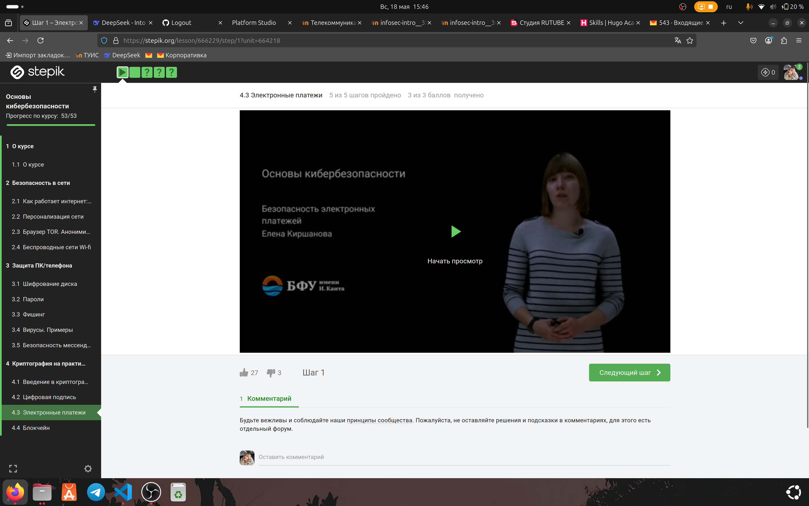
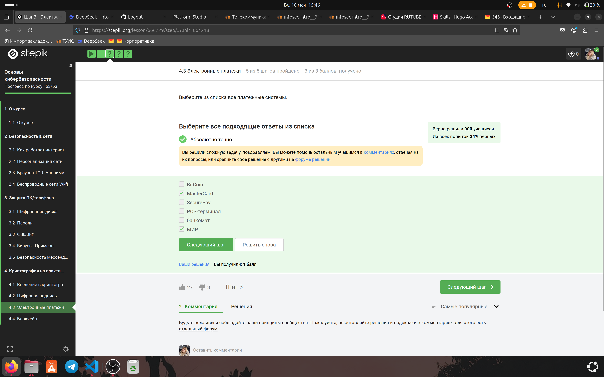
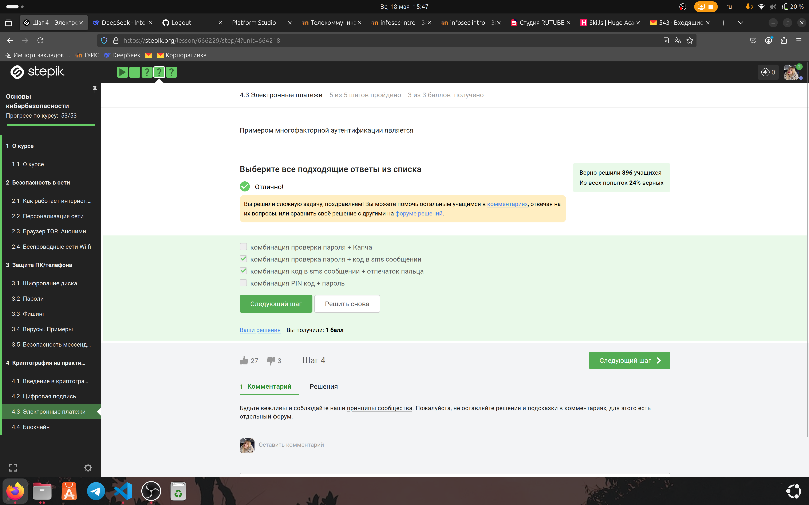
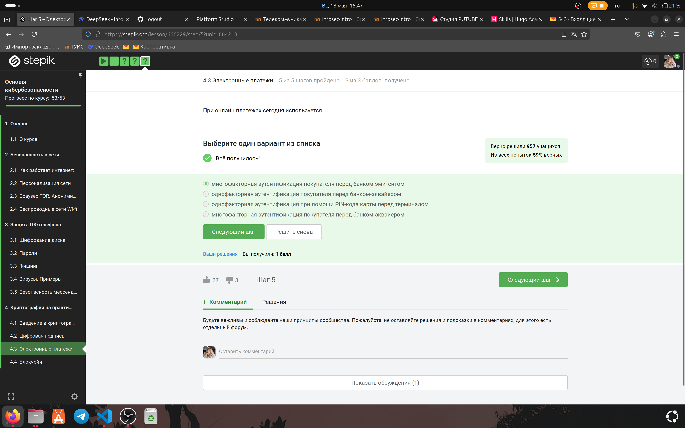

---
# Preamble

## Author

author:
  name: Игнатова Анастасия Александровна
  email: 1132239657@pfur.ru
  affiliation:
    - name: Российский университет дружбы народов
      country: Российская Федерация
      postal-code: 117198
      city: Москва
      address: ул. Миклухо-Маклая, д. 6

## Title

title: "Прохождение внешнего курса stepik 'Основы кибербезопасности'"
subtitle: "4 этап. Криптография на практике"
license: "CC BY"

## Generic options

lang: ru-RU
number-sections: true
toc: true
toc-title: "Содержание"
toc-depth: 2

## Bibliography

bibliography: bib/cite.bib
csl: pandoc/csl/gost-r-7-0-5-2008-numeric.csl

## Pdf output format
format:
  pdf:
    toc: true
    number-sections: true
    colorlinks: false
    toc-depth: 2
    lof: true # List of figures
    lot: true # List of tables
### Document
    documentclass: scrreprt
    papersize: a4
    fontsize: 12pt
    linestretch: 1.5
### Language
    babel-lang: russian
    babel-otherlangs: english
### Fonts
    mainfont: IBM Plex Serif
    romanfont: IBM Plex Serif
    sansfont: IBM Plex Sans
    monofont: IBM Plex Mono
    mathfont: STIX Two Math
    mainfontoptions: Ligatures=Common,Ligatures=TeX,Scale=0.94
    romanfontoptions: Ligatures=Common,Ligatures=TeX,Scale=0.94
    sansfontoptions: Ligatures=Common,Ligatures=TeX,Scale=MatchLowercase,Scale=0.94
    monofontoptions: Scale=MatchLowercase,Scale=0.94,FakeStretch=0.9
### Biblatex
    cite-method: biblatex
    biblio-style: gost-numeric
    biblatexoptions:
      - backend=biber
      - langhook=extras
      - autolang=other*
      # - parentracker=true
      # - hyperref=auto
      # - language=auto
      # - clearlang=true
      # - citestyle=gost-numeric
### Misc options
    csquotes: true
    indent: true
    header-includes: |
      \usepackage{indentfirst}
      \usepackage{float}
      \floatplacement{figure}{H}

## Crossref customization

crossref:
  lof-title: "Список иллюстраций"
  lot-title: "Список таблиц"
  lol-title: "Листинги"
# figureTitle: "Рис."
# tableTitle: "Таблица"
# listingTitle: "Листинг"
---

# Цель работы

Изучить Электронные платежи, посмотреть лекции и выполнить задания

# Задание

1. Изучить раздел "Электронные платежи"

2. Посмотреть лекцию

3. Выполнить задания

4. Пояснить выбор ответа на задания

# Теоретическое введение

Прохождение курса https://stepik.org/course/111512

# Выполнение лабораторной работы

### Раздел 4.3 "Электронные платежи"

Я посмотрела первую лекцию, изучила новый материал и сделала конспект

Рис. 1 Просмотр первой лекции

#### Выполнение заданий

1. Приступила к выполнению 1 задания. Я выбрала ответы "MasterCard" и "МИР", потому что MasterCard и МИР — международные и национальная платёжные системы для банковских карт.

Рис. 2 Выполнение 1 задания

2. Приступила к выполнению 2 задания. Я выбрала ответы "комбинация проверка пароля + код в sms сообщении" и "комбинация код в sms сообщении + отпечаток пальца", потому что капча не является фактором аутентификации.

Рис. 3 Выполнение 2 задания

3. Приступила к выполнению 3 задания. Я выбрала ответ "многофакторная аутентификация покупателя перед банком-эмитентом", потому что при онлайн-платежах по протоколу 3D Secure (например, Verified by Visa, Mastercard SecureCode) банк-эмитент (выпустивший карту) проводит многофакторную аутентификацию (например, пароль + SMS-код), а не банк-эквайер (принимающий платеж) или терминал.

Рис. 4 Выполнение 3 задания

# Выводы

Я изучила Электронные платежи

# Список литературы

https://stepik.org/course/111512