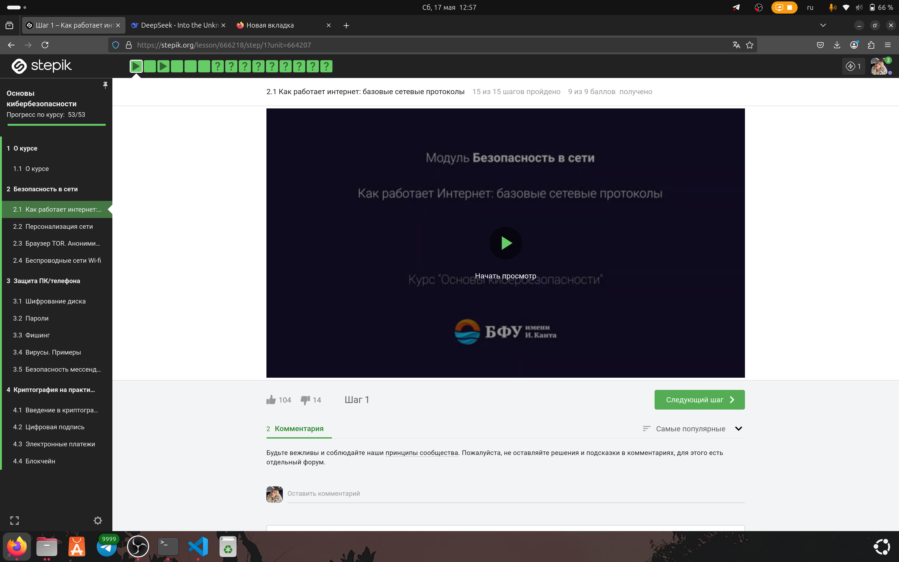
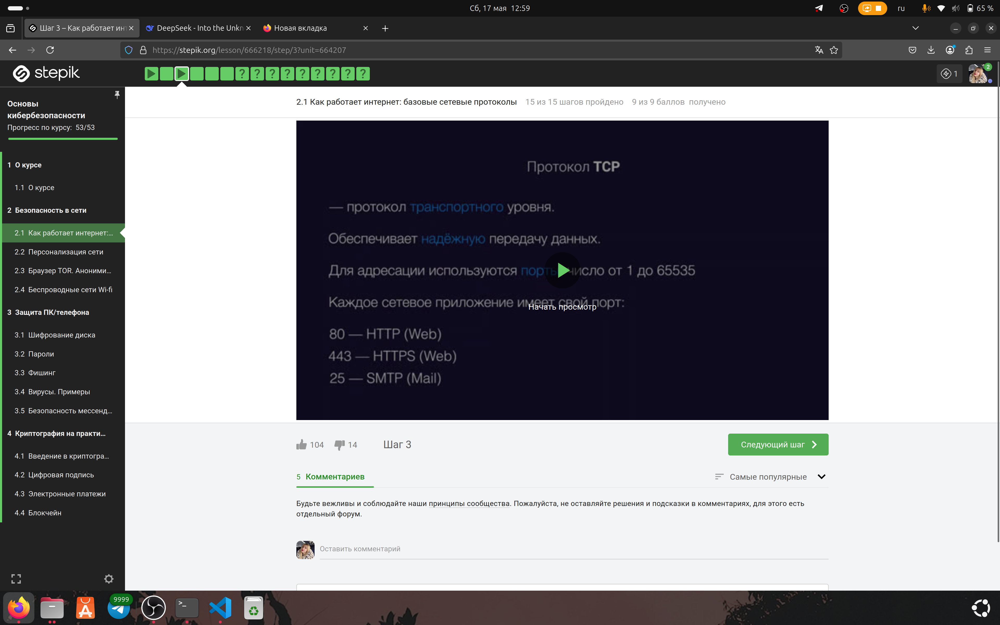
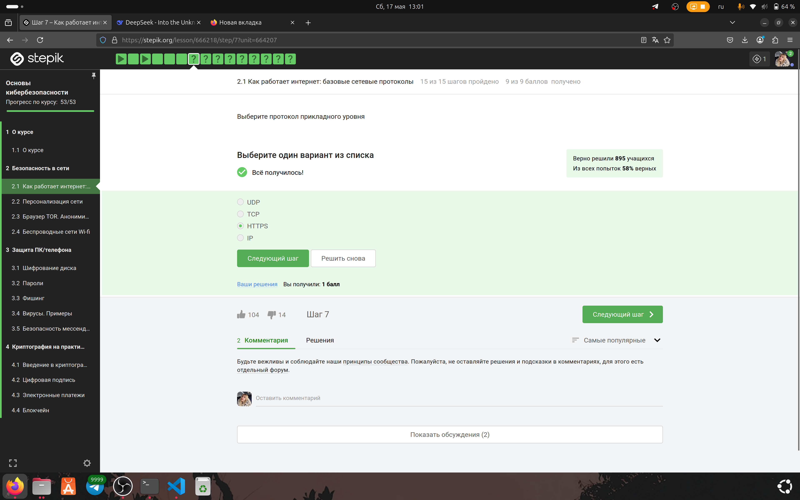
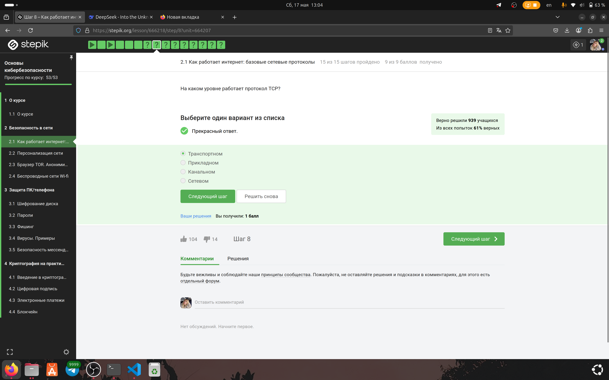
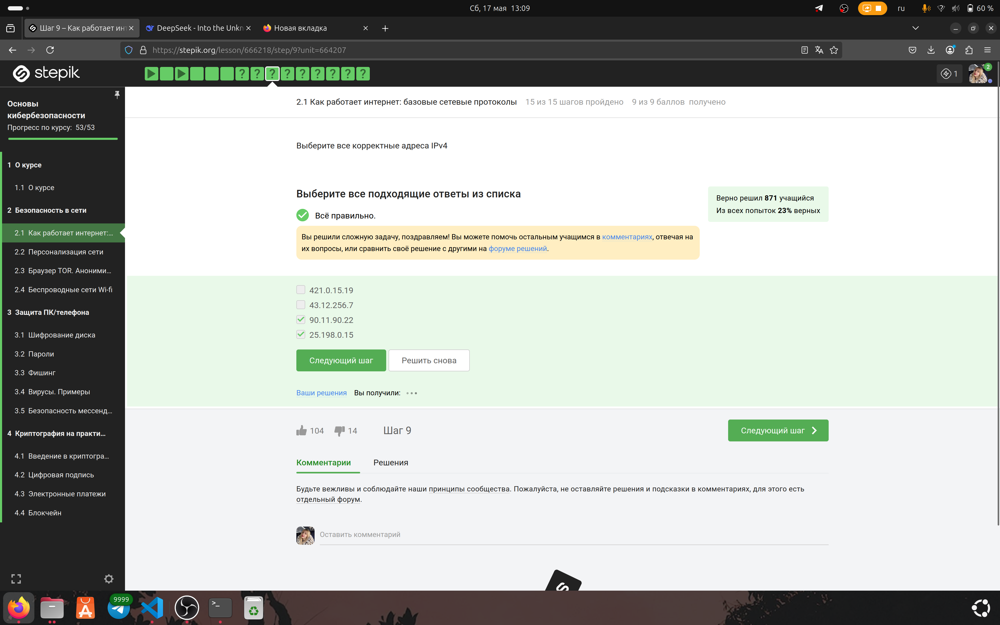
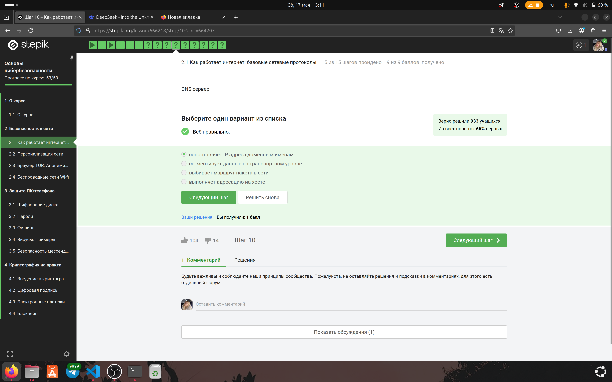
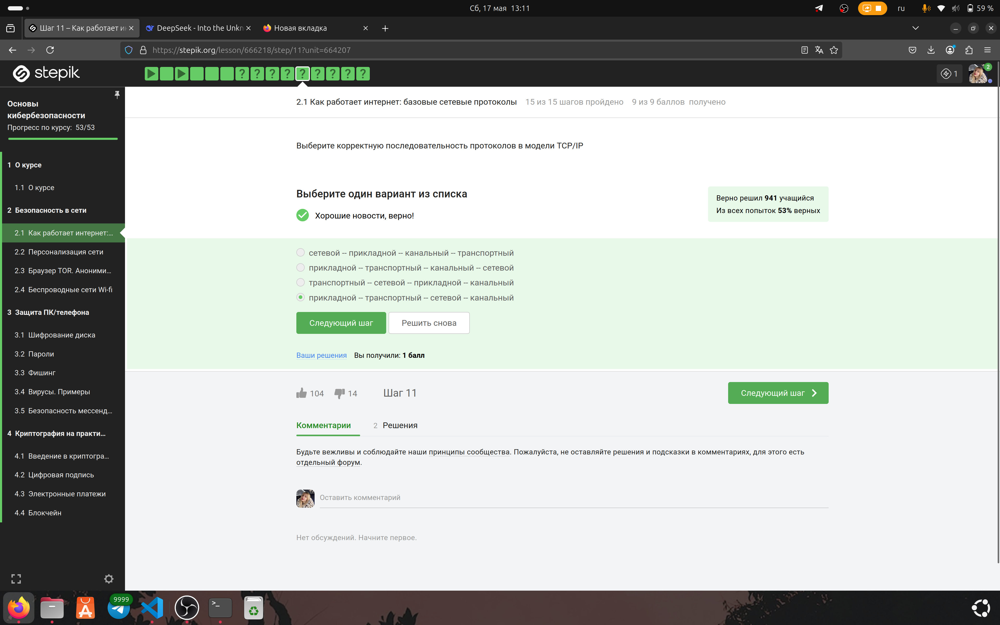
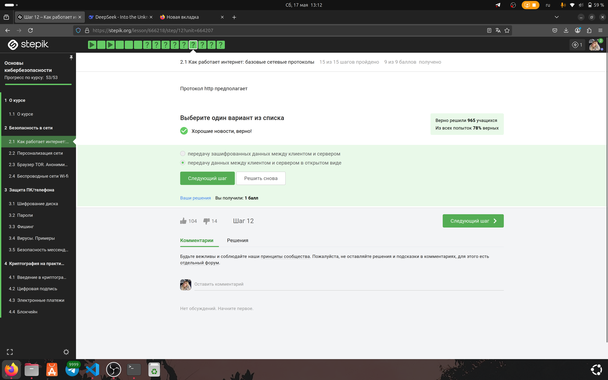
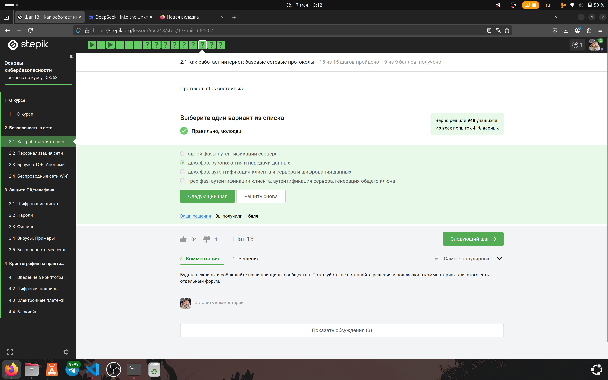
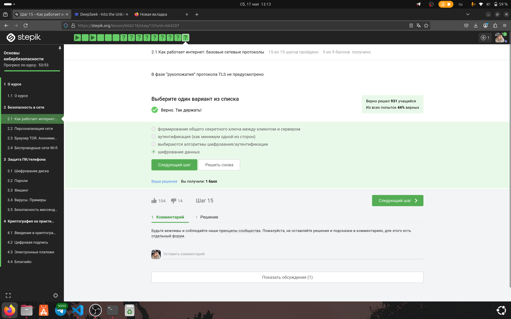

---
# Preamble

## Author

author:
  name: Игнатова Анастасия Александровна
  email: 1132239657@pfur.ru
  affiliation:
    - name: Российский университет дружбы народов
      country: Российская Федерация
      postal-code: 117198
      city: Москва
      address: ул. Миклухо-Маклая, д. 6

## Title

title: "Прохождение внешнего курса stepik 'Основы кибербезопасности'"
subtitle: "2 этап. Безопасность в сети. Раздел 2.1 'Как работает интернет: базовые сетевые протоколы'"
license: "CC BY"

## Generic options

lang: ru-RU
number-sections: true
toc: true
toc-title: "Содержание"
toc-depth: 2

## Bibliography

bibliography: bib/cite.bib
csl: pandoc/csl/gost-r-7-0-5-2008-numeric.csl

## Pdf output format
format:
  pdf:
    toc: true
    number-sections: true
    colorlinks: false
    toc-depth: 2
    lof: true # List of figures
    lot: true # List of tables
### Document
    documentclass: scrreprt
    papersize: a4
    fontsize: 12pt
    linestretch: 1.5
### Language
    babel-lang: russian
    babel-otherlangs: english
### Fonts
    mainfont: IBM Plex Serif
    romanfont: IBM Plex Serif
    sansfont: IBM Plex Sans
    monofont: IBM Plex Mono
    mathfont: STIX Two Math
    mainfontoptions: Ligatures=Common,Ligatures=TeX,Scale=0.94
    romanfontoptions: Ligatures=Common,Ligatures=TeX,Scale=0.94
    sansfontoptions: Ligatures=Common,Ligatures=TeX,Scale=MatchLowercase,Scale=0.94
    monofontoptions: Scale=MatchLowercase,Scale=0.94,FakeStretch=0.9
### Biblatex
    cite-method: biblatex
    biblio-style: gost-numeric
    biblatexoptions:
      - backend=biber
      - langhook=extras
      - autolang=other*
      # - parentracker=true
      # - hyperref=auto
      # - language=auto
      # - clearlang=true
      # - citestyle=gost-numeric
### Misc options
    csquotes: true
    indent: true
    header-includes: |
      \usepackage{indentfirst}
      \usepackage{float}
      \floatplacement{figure}{H}

## Crossref customization

crossref:
  lof-title: "Список иллюстраций"
  lot-title: "Список таблиц"
  lol-title: "Листинги"
# figureTitle: "Рис."
# tableTitle: "Таблица"
# listingTitle: "Листинг"
---

# Цель работы

Изучить раздел 2.1 "Как работает интернет: базовые сетевые протоколы", посмотреть лекции и выполнить задания

# Задание

1. Изучить раздел "Как работает интернет: базовые сетевые протоколы"

2. Посмотреть лекцию

3. Выполнить задания

4. Пояснить выбор ответа на тестовые вопросы

# Теоретическое введение

Прохождение курса https://stepik.org/course/111512

# Выполнение лабораторной работы

### Раздел 2.1 "Как работает интернет: базовые сетевые протоколы"

Я посмотрела первую лекцию, изучила новый материал и сделала конспект

Рис. 1 Просмотр первой лекции

Я посмотрела вторую лекцию, изучила новый материал и сделала конспект

Рис. 2 Просмотр второй лекции

#### Выполнение заданий

1. Приступила к выполнению 1 задания. Я выбрала ответ "HTTPS", потому что HTTPS — это протокол прикладного уровня и работает поверх TCP.

Рис. 3 Выполнение 1 задания

2. Приступила к выполнению 2 задания. Я выбрала ответ "Транспортном", потому что TCP обеспечивает надежную передачу данных между устройствами, что соответствует функциям транспортного уровня модели OSI.

Рис. 4 Выполнение 2 задания

3. Приступила к выполнению 3 задания. Я выбрала ответы "25.198.0.15" и "90.11.90.22", потому что В IPv4 каждый октет (число между точками) должен быть в диапазоне от 0 до 255, а 256.7 и 421.0.15.19 выходят за эти пределы.

Рис. 5 Выполнение 3 задания

4. Приступила к выполнению 4 задания. Я выбрала ответ "сопоставляет IP адреса доменным именам", потому что DNS преобразует удобные для человека доменные имена (например, google.com) в IP-адреса, которые используются для маршрутизации в сети.

Рис. 6 Выполнение 4 задания

5. Приступила к выполнению 5 задания. Я выбрала ответ "сприкладной -- транспортный -- сетевой -- канальный", потому что в модели TCP/IP слои идут сверху вниз: прикладной (HTTP, FTP), транспортный (TCP, UDP), сетевой (IP) и канальный (Ethernet).

Рис. 7 Выполнение 5 задания

6. Приступила к выполнению 6 задания. Я выбрала ответ "передачу данных между клиентом и сервером в открытом виде", потому что HTTP (HyperText Transfer Protocol) передает данные без шифрования, в отличие от HTTPS, где используется шифрование (SSL/TLS).

Рис. 8 Выполнение 6 задания

7. Приступила к выполнению 7 задания. Я выбрала ответ "двух фаз: рукопожатия и передачи данных", потому что HTTPS работает в две основные фазы: сначала происходит аутентификация сервера (и опционально клиента) с помощью SSL/TLS-рукопожатия, затем устанавливается защищенное соединение с шифрованием данных.

Рис. 9 Выполнение 7 задания

8. Приступила к выполнению 8 задания. Я выбрала ответ "и клиентом, и сервером в процессе “переговоров”", потому что версия TLS определяется в ходе TLS-рукопожатия, где клиент и сервер согласовывают максимально поддерживаемую и безопасную версию протокола.

Рис. 10 Выполнение 8 задания

9. Приступила к выполнению 9 задания. Я выбрала ответ "шифрование данных", потому что фаза рукопожатия в TLS предназначена для аутентификации, согласования алгоритмов и обмена ключами, но сами пользовательские данные начинают шифроваться только после завершения этой фазы.

Рис. 11 Выполнение 9 задания
  

# Выводы

Я изучила новый материал, выполнила все задания и теперь знаю про то, как работает интернет и базовые сетевые протоколы

# Список литературы

https://stepik.org/course/111512