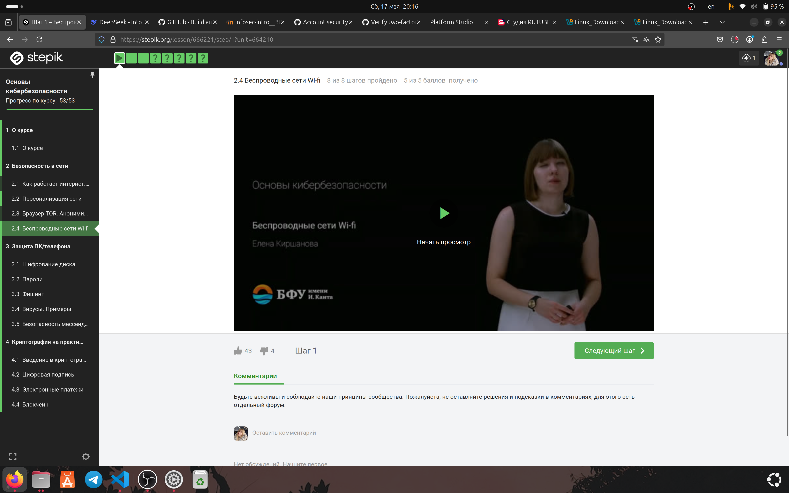
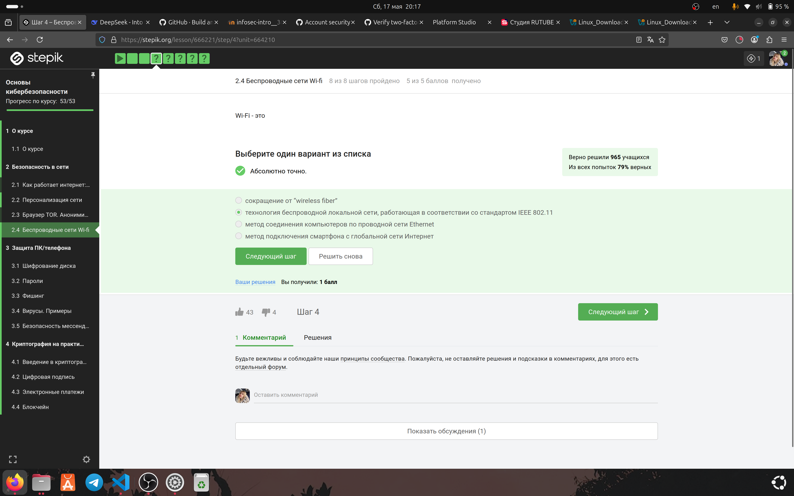
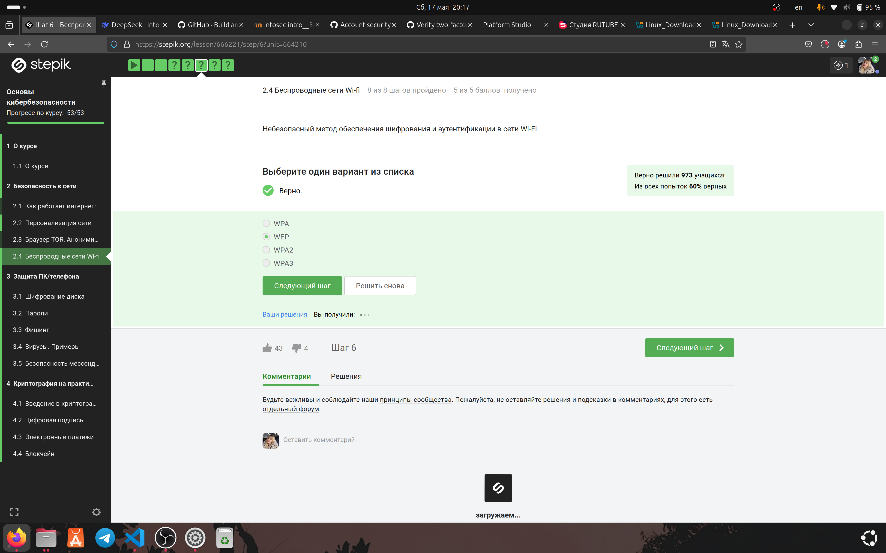
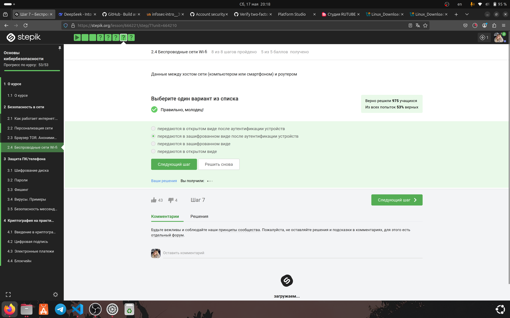
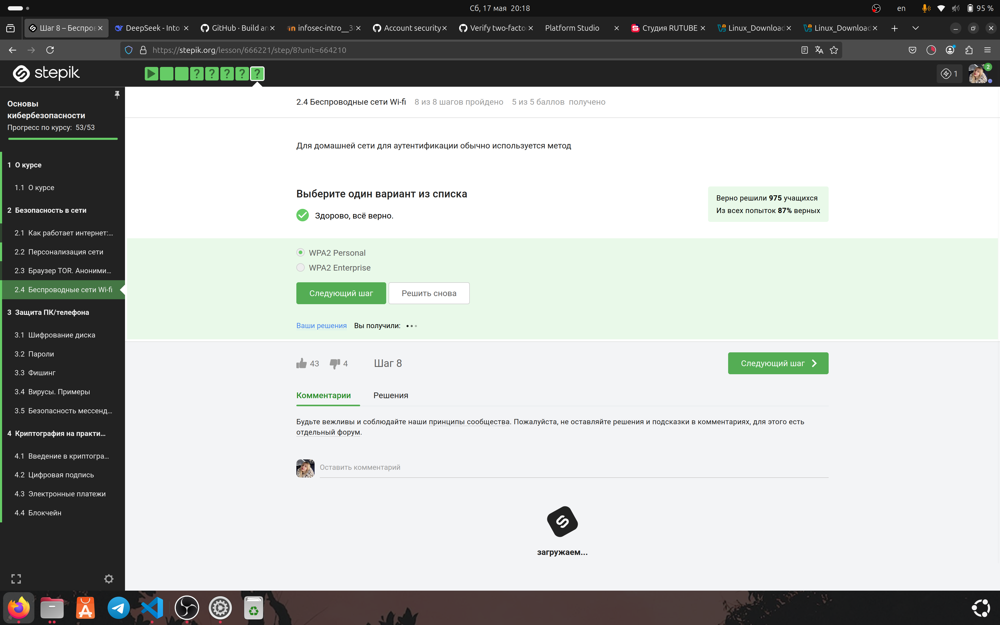

---
# Preamble

## Author

author:
  name: Игнатова Анастасия Александровна
  email: 1132239657@pfur.ru
  affiliation:
    - name: Российский университет дружбы народов
      country: Российская Федерация
      postal-code: 117198
      city: Москва
      address: ул. Миклухо-Маклая, д. 6

## Title

title: "Прохождение внешнего курса stepik 'Основы кибербезопасности'"
subtitle: "2 этап. Безопасность в сети"
license: "CC BY"

## Generic options

lang: ru-RU
number-sections: true
toc: true
toc-title: "Содержание"
toc-depth: 2

## Bibliography

bibliography: bib/cite.bib
csl: pandoc/csl/gost-r-7-0-5-2008-numeric.csl

## Pdf output format
format:
  pdf:
    toc: true
    number-sections: true
    colorlinks: false
    toc-depth: 2
    lof: true # List of figures
    lot: true # List of tables
### Document
    documentclass: scrreprt
    papersize: a4
    fontsize: 12pt
    linestretch: 1.5
### Language
    babel-lang: russian
    babel-otherlangs: english
### Fonts
    mainfont: IBM Plex Serif
    romanfont: IBM Plex Serif
    sansfont: IBM Plex Sans
    monofont: IBM Plex Mono
    mathfont: STIX Two Math
    mainfontoptions: Ligatures=Common,Ligatures=TeX,Scale=0.94
    romanfontoptions: Ligatures=Common,Ligatures=TeX,Scale=0.94
    sansfontoptions: Ligatures=Common,Ligatures=TeX,Scale=MatchLowercase,Scale=0.94
    monofontoptions: Scale=MatchLowercase,Scale=0.94,FakeStretch=0.9
### Biblatex
    cite-method: biblatex
    biblio-style: gost-numeric
    biblatexoptions:
      - backend=biber
      - langhook=extras
      - autolang=other*
      # - parentracker=true
      # - hyperref=auto
      # - language=auto
      # - clearlang=true
      # - citestyle=gost-numeric
### Misc options
    csquotes: true
    indent: true
    header-includes: |
      \usepackage{indentfirst}
      \usepackage{float}
      \floatplacement{figure}{H}

## Crossref customization

crossref:
  lof-title: "Список иллюстраций"
  lot-title: "Список таблиц"
  lol-title: "Листинги"
# figureTitle: "Рис."
# tableTitle: "Таблица"
# listingTitle: "Листинг"
---

# Цель работы

Изучить Беспроводные сети Wi-fi, посмотреть лекции и выполнить задания

# Задание

1. Изучить раздел "Беспроводные сети Wi-fi"

2. Посмотреть лекцию

3. Выполнить задания

4. Пояснить выбор ответа на задания

# Теоретическое введение

Прохождение курса https://stepik.org/course/111512

# Выполнение лабораторной работы

### Раздел 2.4 "Беспроводные сети Wi-fi"

Я посмотрела первую лекцию, изучила новый материал и сделала конспект

Рис. 1 Просмотр первой лекции

#### Выполнение заданий

1. Приступила к выполнению 1 задания. Я выбрала ответ "технология беспроводной локальной сети, работающая в соответствии со стандартом IEEE 802.11", потому что Wi-Fi — это стандарт беспроводной связи (IEEE 802.11) для создания локальных сетей (WLAN), а не проводных соединений, глобального интернета или «wireless fiber»

Рис. 2 Выполнение 1 задания

2. Приступила к выполнению 2 задания. Я выбрала ответ "Канальном", потому что Wi-Fi (IEEE 802.11) работает на канальном уровне (L2) модели OSI, обеспечивая передачу данных между устройствами в локальной сети через радиоканал, аналогично Ethernet.

Рис. 3 Выполнение 2 задания

3. Приступила к выполнению 3 задания. Я выбрала ответ "WEP", потому что WEP (Wired Equivalent Privacy) устарел и уязвим к взлому из-за слабого шифрования (RC4 и статических ключей), в отличие от более современных WPA2/WPA3.

Рис. 4 Выполнение 3 задания

4. Приступила к выполнению 4 задания. Я выбрала ответ "передаются в зашифрованном виде после аутентификации устройств", потому что в современных Wi-Fi-сетях (WPA2/WPA3) данные шифруются (например, с помощью AES-CCMP) только после успешной аутентификации устройства и установки защищенного соединения.

Рис. 5 Выполнение 4 задания

5. Приступила к выполнению 5 задания. Я выбрала ответ "WPA2 Personal", потому что в домашних сетях чаще используется WPA2 Personal (PSK — Pre-Shared Key), так как он требует только пароля, тогда как WPA2 Enterprise нужен RADIUS-сервер и сложная инфраструктура, что характерно для корпоративных сетей.

Рис. 6 Выполнение 5 задания

# Выводы

Я изучила беспроводные сети Wi-Fi

# Список литературы

https://stepik.org/course/111512